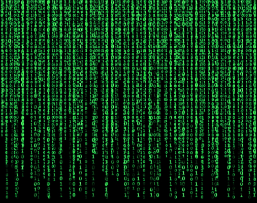

# matrix
The famous Matrix screensaver, now on your TI-84+ CE!

## Usage
1. Send program to calc and run the program.
2. Special keys when run:
    | Key         | Action                                                                          |
    | ----------- | ------------------------------------------------------------------------------- |
    | `[clear]`   | Quit                                                                            |
    | `[math]`    | Toggle asynchronous scroll (different columns have different speed)             |
    | `[X,T,θ,n]` | Toggle old-style scrolling (text follow scroll)                                 |
    | `[×]`       | Toggle rainbow mode                                                             |
    | `[1]-[7]`   | Change color to red, green, yellow, blue, purple, cyan, and white, respectively |
    | `[↑]`       | Decrease speed (increase delay)                                                 |
    | `[↓]`       | Increase speed (decrease delay)                                                 |
